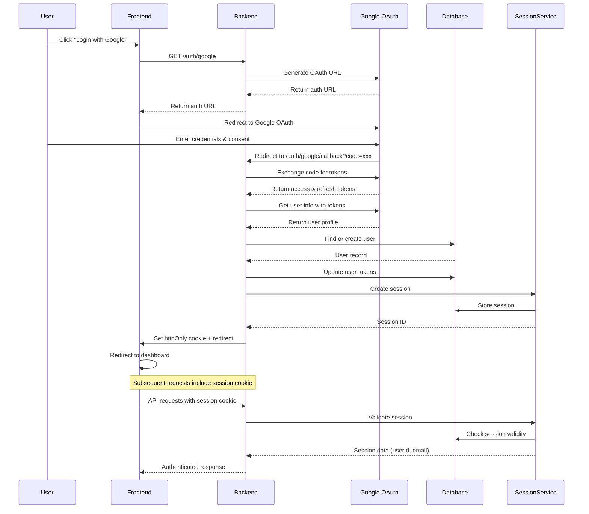
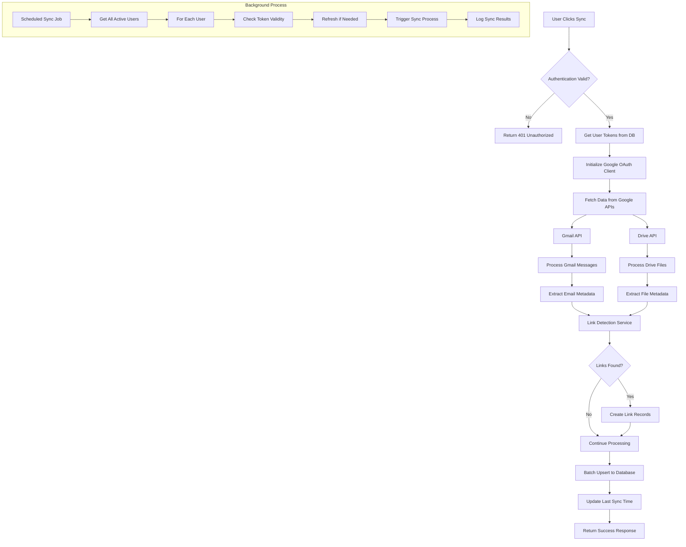
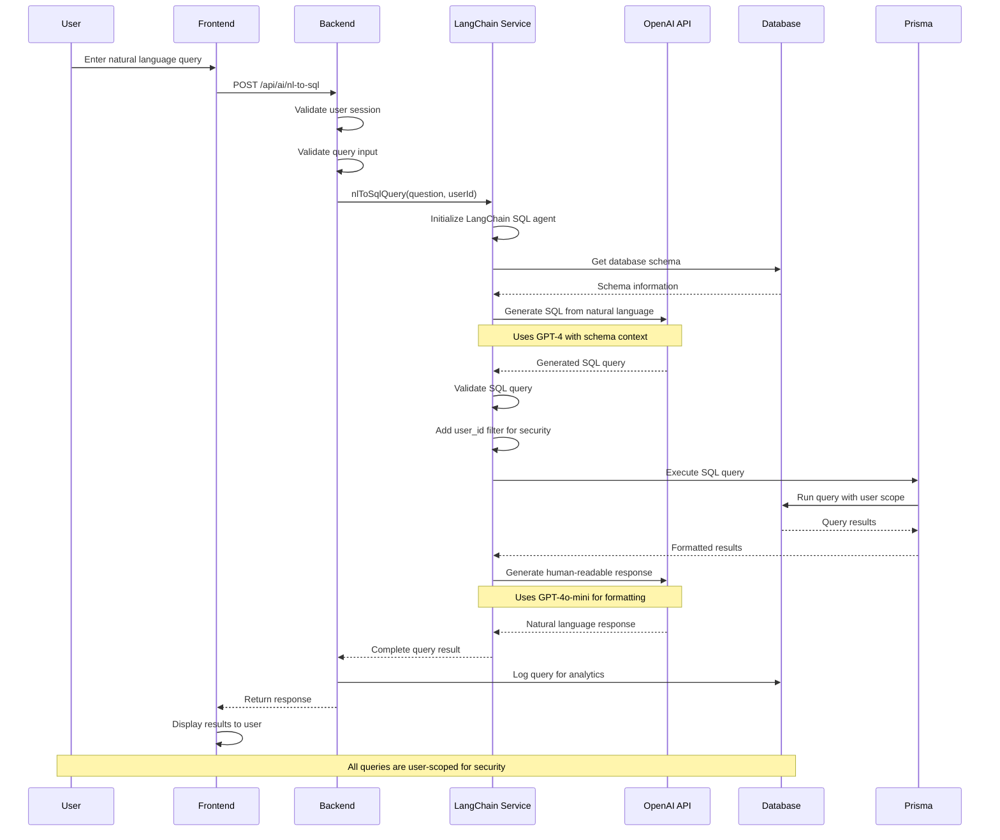
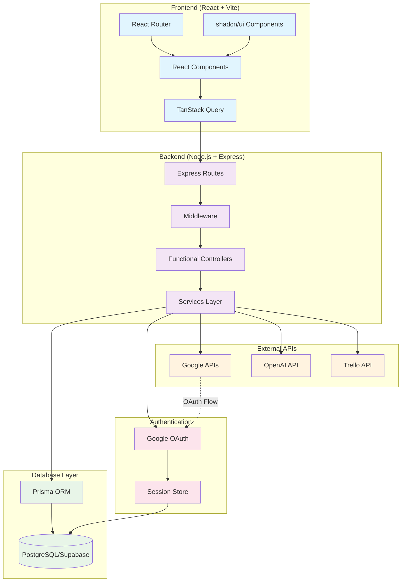
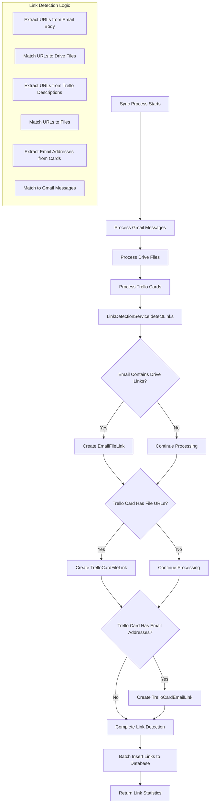
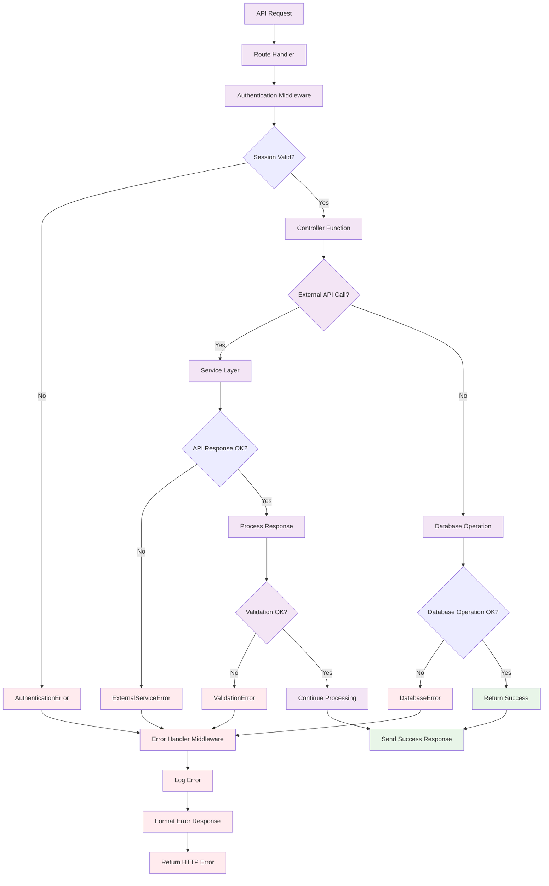
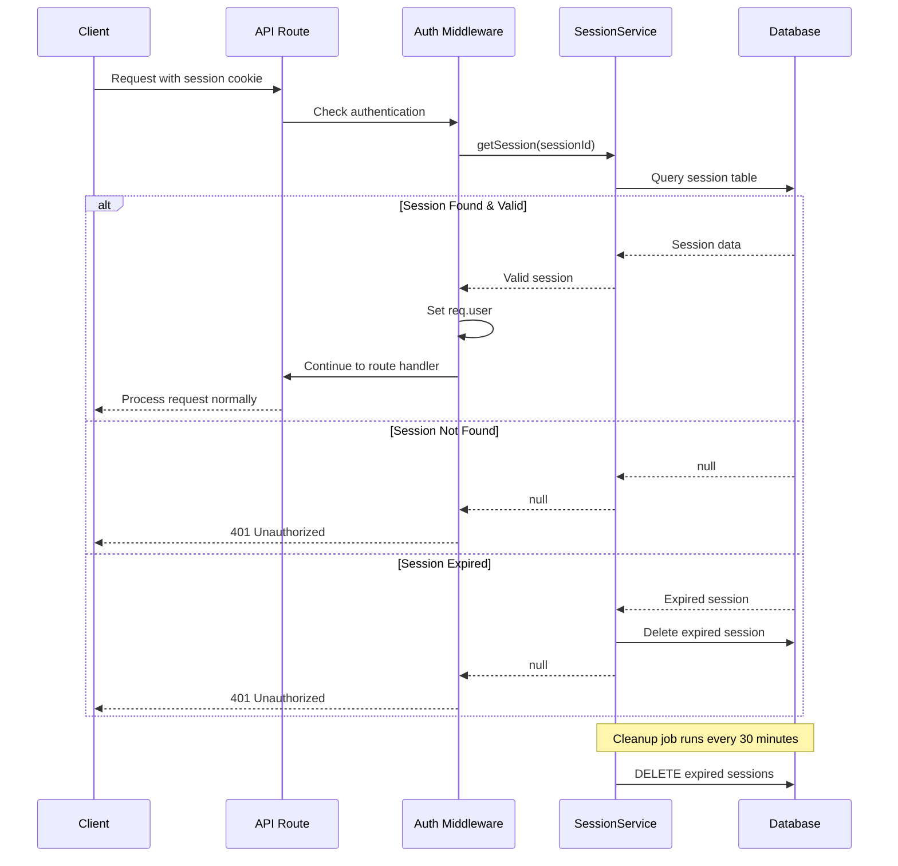
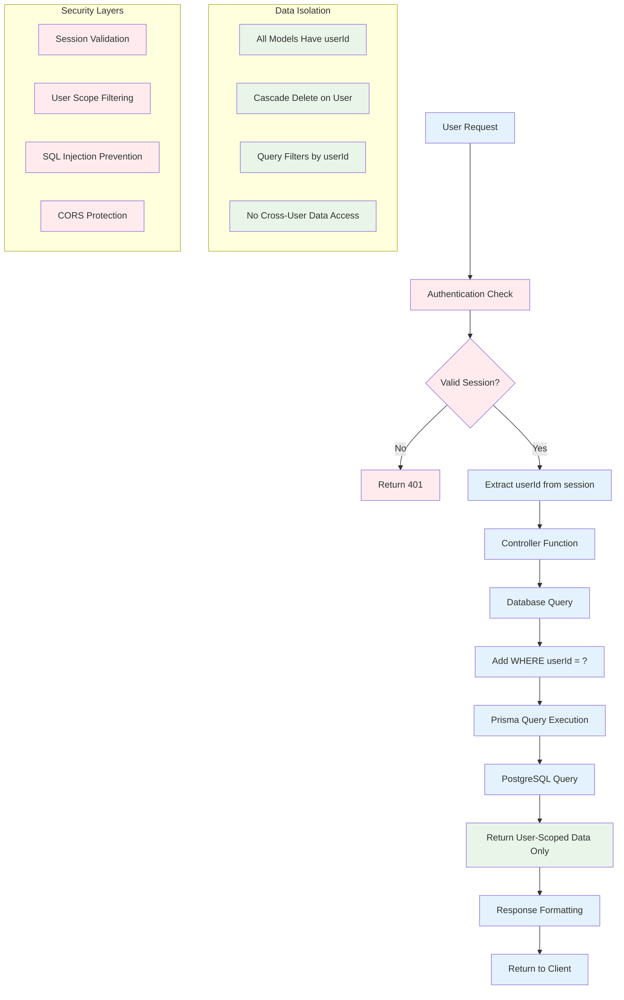
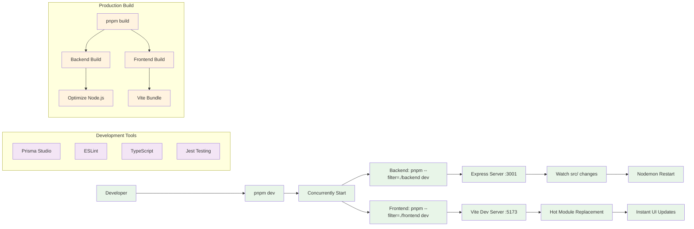

# UnFrame AI Application Flow

This document contains Mermaid diagrams illustrating the key application flows and architecture.

## 1. Authentication Flow



## 2. Data Synchronization Flow



## 3. AI Query Processing Flow



## 4. Overall Application Architecture



## 5. Link Detection Flow



## 6. Dependency Injection Flow

```mermaid
graph TD
    A[Application Startup] --> B[controllers/index.js]
    
    B --> C[Initialize Core Dependencies]
    C --> D[new PrismaClient()]
    C --> E[new OpenAI()]
    C --> F[new GoogleOAuthService()]
    C --> G[new TrelloService()]
    
    B --> H[Initialize Service Layer]
    H --> I[new SessionService(prisma)]
    H --> J[new LinkDetectionService(prisma)]
    H --> K[new LangChainSqlService(openai, prisma)]
    
    B --> L[Create Controller Factories]
    L --> M[createAIControllers({openai, prisma, langchainService})]
    L --> N[createGmailControllers({googleOAuth, prisma, linkDetectionService})]
    L --> O[createDriveControllers({googleOAuth, prisma, linkDetectionService})]
    L --> P[createTrelloControllers({trelloService, prisma})]
    
    M --> Q[Export Centralized Controllers]
    N --> Q
    O --> Q
    P --> Q
    
    Q --> R[Route Files Import Controllers]
    R --> S[No Direct Service Instantiation]
    
    classDef dependency fill:#e3f2fd
    classDef service fill:#f1f8e9
    classDef controller fill:#fff8e1
    classDef route fill:#fce4ec
    
    class D,E,F,G dependency
    class I,J,K service
    class M,N,O,P controller
    class R,S route
```

## 7. Error Handling Flow



## 8. Session Management Flow



## 9. User Data Flow & Security



## 10. Monorepo Development Flow



These diagrams provide a comprehensive view of the UnFrame AI application architecture, showing how different components interact, data flows through the system, and how security and user isolation is maintained throughout the application.